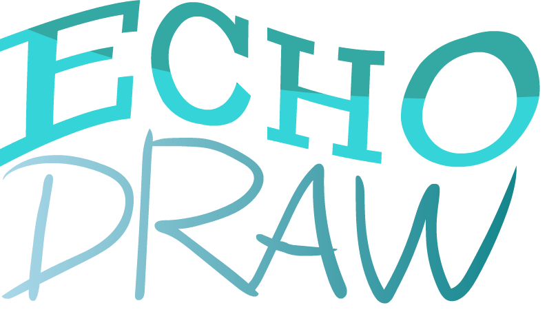

# EchoDraw

## 💡 Inspiration

As students, we’ve all experienced classrooms where engagement fades quickly — students hesitate to participate for fear of making mistakes, and teachers struggle to identify learning gaps in real time. We were inspired to create **EchoDraw** to make classrooms more interactive, anonymous, and insightful. By blending collaborative whiteboarding with real-time feedback, EchoDraw helps teachers **see what students are thinking** without the pressure of raising hands.

## 🔍 What it does

**EchoDraw** allows teachers to create lessons composed of **digital whiteboard questions**.  
Students can **join a lesson using a unique code**, respond on their own **digital whiteboards**, and **submit their answers anonymously**.  
Teachers can then:

- **Shuffle through responses** to identify common misconceptions.
- **Annotate directly on submissions** to highlight and correct mistakes.
- **Compile all responses into a single PDF** and export it to their digital classroom platform for review or sharing.

The result is a more **engaged classroom**, **faster feedback loops**, and **deeper learning**.

## ⚙️ How we built it

Frontend:

- **React + Nextjs + TailwindCSS** for building a responsive, intuitive, and modern user interface.
- **Excalidraw** to power the interactive digital whiteboards, enabling smooth drawing, real-time updates, and annotation features for both students and teachers.

Backend:

- **Supabase** handles user authentication, whiteboard data synchronization, and database storage. It allows lessons, student submissions, and annotations to be stored and retrieved efficiently, while keeping setup and integration lightweight.

## 🪦 Challenges we ran into

- **Integrating the backend with the frontend** proved more complex than expected. Setting up seamless communication between React and Supabase required careful structuring and debugging.
- We faced **version control and synchronization issues**, which occasionally led to merge conflicts and slowed down development as we coordinated changes across the team.
- **Integrating Excalidraw** into our project also presented some hurdles — especially around customizing its features to fit our lesson and submission workflows smoothly.

## 😁 Accomplishments that we're proud of

- Creating a **fully functional and practical digital classroom tool** during the hackathon.
- Implementing a **whiteboard system** that’s lightweight yet feature-rich.
- Seamlessly integrating **PDF generation** for lesson summaries.
- Achieving a **smooth teacher-student workflow** from lesson creation to feedback export.

## 📖 What we learned

Throughout the development of EchoDraw, we gained valuable experience in **frontend–backend integration**, especially when connecting React with Supabase for real-time functionality. We learned how to manage **version control collaboratively**, resolving conflicts and keeping our workflow organized. Integrating **Excalidraw** taught us how to adapt external libraries to fit our specific use case, customizing its features for classroom interactions. Overall, we improved our ability to **work as a team under time pressure**, build efficiently with new tools, and structure a project from idea to functional prototype.

## 🤔 What's next for EchoDraw

**Analytics Dashboard**: Provide teachers with insights into common mistakes, participation rates, and progress trends over time.

**Multi-Lesson Support**: Allow teachers to save and reuse lessons, enabling more structured course planning.

**Handwriting Recognition**: Use AI to parse handwritten answers, allowing for auto-grading or feedback suggestions.

**Integration with LMS platforms**: Seamless export to Google Classroom, Canvas, or Microsoft Teams.

**Mobile App Version**: Extend EchoDraw to iOS and Android for increased accessibility across devices.
